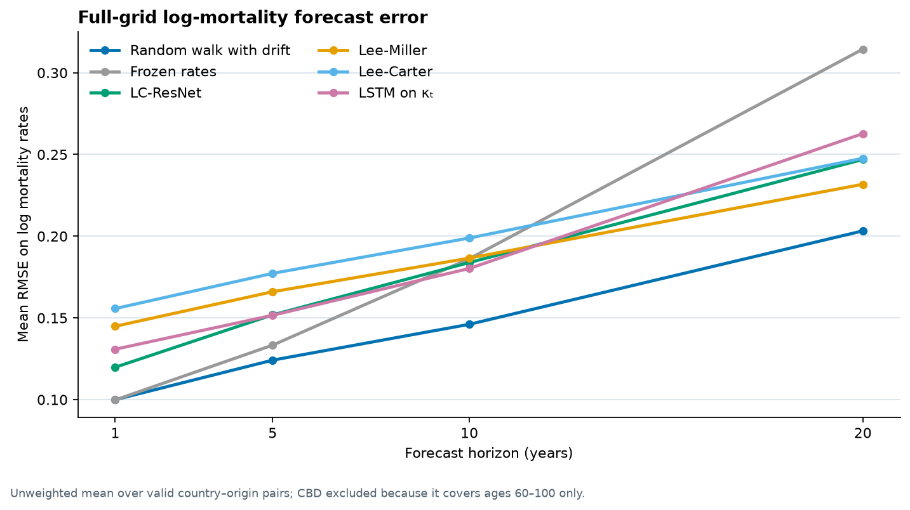

# Neural Mortality Benchmark

[](https://github.com/aminemanai2003/neural-mortality-benchmark/actions/workflows/ci.yml)
[](https://www.python.org/)
[](LICENSE)

**When should actuaries trust neural networks for mortality forecasting?**

A reproducible benchmark of 14 classical, baseline, neural and hybrid mortality-forecasting implementations. The study uses rolling-origin validation, actuarial error metrics and an illustrative French annuity case study to test when additional model complexity is useful.

> **Research status:** independent working paper, version 0.1.0. The manuscript has not been peer reviewed and is not presented as an accepted publication.

## Author

**Amine Manai** — M1 Actuarial Science at Le Mans Université, Institut du Risque et de l’Assurance; double-degree student in Data Science Engineering at ESPRIT.

- [Working paper (PDF)](paper/main.pdf)
- [French technical report](report/rapport.md)
- [Methodology and defense notes](DEFENSE_NOTES.md)
- [Stored benchmark results](results/README.md)

## Study design

- **14 implementations:** five classical structural models, two simple baselines, six neural architectures and the proposed LC-ResNet hybrid.
- **Eight national populations:** France, England and Wales, USA, Japan, Italy, Spain, Sweden and the Netherlands.
- **Rolling-origin validation:** origins from 1990 to 2018 and horizons of 1, 5, 10 and 20 years when observations are available.
- **Actuarial metrics:** error on period life expectancy at birth and an annuity-due factor at age 65, both truncated at age 100.
- **Targeted scenarios:** short histories, the reported 2020–2022 mortality-shock
  window and separate age segments.
- **Illustrative liability study:** 1,000 French annuitants valued with 2033 projected rates and a permanent 20% mortality-rate reduction.

| Classical and baseline | Neural | Hybrid |
|---|---|---|
| Lee-Carter, Lee-Miller, Poisson LC, CBD, H-U-style functional model, age-specific random walk with drift, frozen rates | LSTM, GRU, Bi-LSTM and Transformer on κₜ; FFNN with embeddings; mortality-surface CNN | **LC-ResNet** |

The H-U implementation is deliberately simplified: spline smoothing, six functional components and random-walk-with-drift score forecasts. It is not the full robust automatic-ARIMA procedure.

## Main findings

- The age-specific random walk with drift has the lowest full-grid log-rate RMSE at every tested horizon.
- LC-ResNet has the lowest one-year error among structured models; Lee-Miller performs better at 20 years.
- The H-U-style model has the lowest 20-year life-expectancy RMSE, while the FFNN has the lowest 20-year annuity-factor RMSE.
- Frozen rates lead the cumulative 2020–2022 stress test and the 20-year-history scenario.
- In the illustrative French case study, the five-model base-liability spread is **€6.26 million**; it is **€1.22 million** among the four full-age-grid models.
- The liability increase under the 20% longevity stress varies from **€11.52 million to €12.33 million** across the five models.

These findings are specific to the selected populations, period, origins, loss functions and training budget. They are evidence from this benchmark, not universal model rankings.



## LC-ResNet

LC-ResNet combines:

1. a Poisson Lee-Carter skeleton `(aₓ, bₓ, κₜ)`;
2. a small neural network trained on the structured residuals;
3. horizon-dependent shrinkage, where the neural correction is multiplied by `exp(−λh)`.

The Lee-Carter component remains reportable, but the residual network is opaque. The complete hybrid is therefore **partially interpretable**, not fully interpretable.

## Reproduce the project

### 1. Install the locked environment

```bash
git clone https://github.com/aminemanai2003/neural-mortality-benchmark.git
cd neural-mortality-benchmark
uv sync --all-extras --frozen
```

Python 3.11 or later and [uv](https://docs.astral.sh/uv/) are required. A hash-locked pip export is also available in [`requirements.lock`](requirements.lock).

### 2. Download HMD data

Create a local `.env` from [`.env.example`](.env.example), then add credentials for your free HMD account:

```dotenv
HMD_USERNAME=your-email@example.com
HMD_PASSWORD=your-password
```

```bash
uv run python scripts/download_hmd.py
```

The downloader writes an untracked manifest containing retrieval timestamps and file hashes for future runs.

### 3. Run the analyses

```bash
# Reduced benchmark for a fast functional check
uv run python scripts/run_benchmark.py --countries FRATNP --quick

# Complete benchmark and the French case study
uv run python scripts/run_benchmark.py
uv run python scripts/run_case_study.py

# Dashboard, tests and summary chart
uv run streamlit run dashboard/app.py
uv run pytest
uv run python scripts/plot_summary.py
```

## Data licence and reproducibility boundary

The project uses Human Mortality Database estimates. HMD-produced estimates are distributed under **CC BY 4.0**, while source input data may remain subject to the original providers’ terms. HMD recommends that users download a current copy rather than pass around local copies. See the [HMD User Agreement](https://www.mortality.org/Data/UserAgreement) and [citation guidance](https://www.mortality.org/Research/CitationGuidelines).

Raw data are therefore not committed here. The repository can re-execute the study for an authorized HMD user, but the exact download date of the snapshot behind the checked-in 2026 results was not recorded. HMD revisions may cause future reruns to differ slightly; new downloads now create a local manifest to preserve that provenance.

## Repository map

```text
src/mortality/       data loading, models, evaluation and actuarial calculations
scripts/             benchmark, case study, download and chart entry points
config/              data, model and evaluation settings
tests/               automated unit and integration tests
results/             stored benchmark rows, case study and summary figure
paper/               LaTeX working-paper source and compiled PDF
report/              French technical report and generated DOCX
dashboard/           Streamlit application
```

## Important limitations

- National-population mortality is not insured-portfolio mortality.
- The study uses one neural seed and no model-specific hyperparameter search.
- Forecasts are point estimates; interval calibration and formal pairwise tests are not reported.
- Actuarial metrics stop at age 100.
- Countries contribute different numbers of valid origins because their series end in different years.
- The 20% longevity stress is applied to liabilities only; its output is not a complete insurer-level SCR calculation.
- The precise HMD retrieval date for the stored benchmark was not preserved.

## Citation and licence

Citation metadata are provided in [`CITATION.cff`](CITATION.cff). The software is released under the [MIT License](LICENSE). HMD data remain governed by their own licence and source-provider terms.
